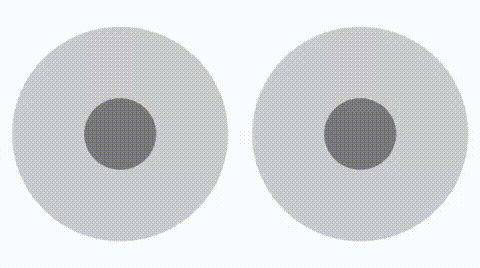

# Axis Pad for React Native
> A virtual joystick for touch capable mobile devices.

[](https://npmjs.org/package/react-native-axis-pad)
[](https://npmjs.org/package/react-native-axis-pad)
[](https://npmjs.org/package/react-native-axis-pad)
[](https://npmjs.org/package/react-native-axis-pad)

# Table Of Contents
<details>

<!-- toc -->

- [Install](#install)
- [Preview](#preview)
- [Usage](#usage)
- [Props](#props)
  * [`step`](#step)
  * [`onValue`](#onvalue)
- [Contributing](#contributing)

<!-- tocstop -->
</details>

## Install

```bash
npm install react-native-axis-pad --save
```

----

## Preview




----

## Usage

Import it the way you want into your project :

```javascript
// import module
import AxisPad from 'react-native-axis-pad';
```
##### Single Stick

```javascript
// render
<AxisPad
    resetOnRelease={true}
    autoCenter={true}
    onValue={({ x, y }) => {
        // values are between -1 and 1
        console.log(x, y);
    }}>
    <Text>Optional Component</Text>
</AxisPad>
```

##### Dual Stick
**_Note_**: Multi-touch for Android is not supported yet!
```javascript
// render
<View style={{flexDirection:'row',justifyContent: 'space-around', alignItems: 'center'}}>
    <AxisPad
        resetOnRelease={true}
        autoCenter={true}
        onValue={({ x, y }) => {
            // values are between -1 and 1
            console.log(x, y);
        }} />
    <AxisPad
        resetOnRelease={true}
        autoCenter={true}
        onValue={({ x, y }) => {
            // values are between -1 and 1
            console.log(x, y);
        }} />
</View>
```

## Props
You can configure your axis pad in react-native props :
(All options are optional)
```javascript
    size: Integer,              // Wrapper circle size. Default: 300
    handlerSize : Intager,      // Handler circle size. Default: 150
    wrapperStyle : Object,      // Wrapper circle styles.
    handlerStyle : Object,      // Handler circle styles.
    step: Float,                // Step size for values. Default: 0
    lockX: Boolean,             // Block to X axis movement. Default: false
    lockY: Boolean,             // Block to Y axis movement. Default: false
    autoCenter: Boolean,        // Move wrapper to center of your touch area. Default: false 
    resetOnRelease: Boolean     // Set (0,0) position on touch end.  Default: false
    onValue: Function           // callback: returned values { x:Float, y:Float }
```

#### `step`
Step size for all axis changes. Example: 1/3 is 3 step down, 0 and 3 step up. 
Total 7 values: [ -1, -0.66 , -0.33 , 0 , 0.33 , 0.66 , 1]

----

#### `onValue`
> Returned the position values.

Is triggered when axis changed. "x" and "y" values are between -1 and 1.

----

## Contributing
If you want to contribute to a project and make it better, your help is very welcome. Contributing is also a great way to learn more about social coding on Github, new technologies and and their ecosystems and how to make constructive, helpful bug reports, feature requests and the noblest of all contributions: a good, clean pull request.

